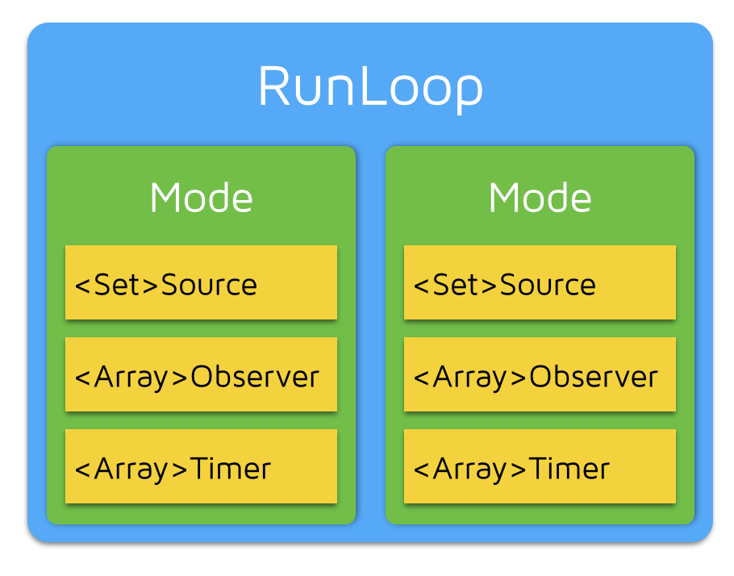

## RunLoop

1. RunLoop   只有main 和 current 不能直接创建

   - RunLoop 的管理是基于线程的：底层有个全局字典以线程为key，runloop为value
   - 线程创建的时候并不会创建RunLoop，而是调用current（当前线程RunLoop）时候创建（懒加载）并存入字典
   - 因为线程只有两种 main 和 current，所以只能获取当前线程内的RunLoop（current）和主线程的RunLoop（main）

2. RunLoop 包含多个mode，每个mode又有若干个source/timer/observer（mode item 就叫 事件 吧 未考证）（CF框架下）

   - CFRunloopSourceRef/CFRunLoopTimerRef/CFRunLoopObserverRef

   

   

   - RunLoop 每次调用主函数只能指定一个mode，切换时候需要先退出loop，然后重新执行mode进入，这样可以分开不同组事件，不会干扰

   - source 有两种 0 和 1： 0 事件只有一个函数回调，这类事件会先被标记为待处理然后，手动唤醒RunLoop进行处理；1 事件处理函数回调指针还有个mach_port 它能够主动唤醒RunLoop（更底层的事件）

   - timer 和NSTimer 是 toll-free bridged 可以混用，特定时间唤醒RunLoop执行回调

   - observer 当RunLoop 状态发生改变的时候观察者通过回调得到这个变化

     ```objective-c
     //RunLoop 状态
     typedef CF_OPTIONS(CFOptionFlags, CFRunLoopActivity) {
         kCFRunLoopEntry         = (1UL << 0), // 即将进入Loop
         kCFRunLoopBeforeTimers  = (1UL << 1), // 即将处理 Timer
         kCFRunLoopBeforeSources = (1UL << 2), // 即将处理 Source
         kCFRunLoopBeforeWaiting = (1UL << 5), // 即将进入休眠
         kCFRunLoopAfterWaiting  = (1UL << 6), // 刚从休眠中唤醒
         kCFRunLoopExit          = (1UL << 7), // 即将退出Loop
     };
     ```

   - 一个事件（mode item）可以同时加入多个mode，单同一个mode多次加入相同item是无效的。如果mode中没有item，RunLoop退出

3. 苹果给出了公开给出了两个mode：default 和 UITracking，这两个mode都被标记为 common

   - RunLoop 结构中维护了一个commonModes 和 commonModeItems，会将commonModeItems的item 同时加到commonModes中
   - 如果某些事件在 default 和 UITracking Mode中都要被处理，就可以通过将其加入到commonModeItems中实现，当然也可以分别加入。例如NSTimer 通常加在default 但是滚动的时候 RunLoop被切换到了UITracking，那么default的timer就不会工作，所以要把timer也加到UITracking里

4. dispath_async 到主线程时候也会唤醒RunLoop 执行block操作

### 参考

[深入理解Runloop](https://blog.ibireme.com/2015/05/18/runloop/)

[Mr.Peak Runloop 解密](https://mp.weixin.qq.com/s?__biz=MjM5OTM0MzIwMQ%3D%3D&amp=&amp=&amp=&amp=&chksm=bcd2a88a8ba5219c216925425365c77088cf7631c7183b57399a3730f59fa0de29d4feb31dc7&idx=1&mid=2652564868&sn=f24de2e854b14fbeb56c84bb717d8749)

