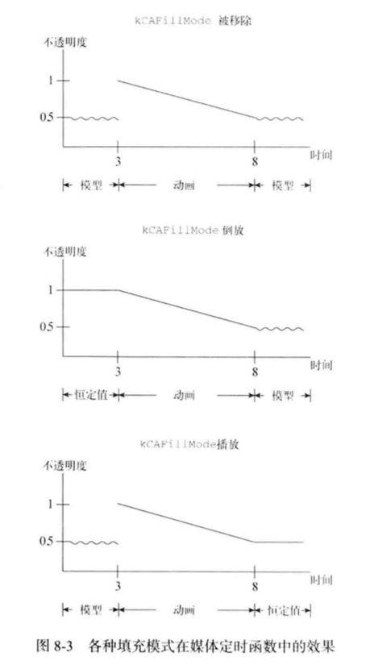

# iOS 编程实战

- 关联引用用来观察对象何时被释放

- 弱引用容器：`NSPointerArray` `NSHashTable` `NSMapTable` 官方文档统称为指针容器类（pointer collection class）

  NSPointerArray --> NSArray, NSHashTable --> NSSet,  NSMapTable --> NSDictionary

- CFStringTransform 转换字符串：将汉字转为拉丁(拼音）.

- 初始化方法使用instancetype 表示“当前类”，在继承的时候不会警告

- 使用perform自定义切换动画

- CALayer 触发绘制的时机

  1. setNeedsDisplay 标记为需要显示
  2. displayIfNeeded 调用display
  3. display
  4. delegate displayLayer:  display 调用委托方法，如果实现了的话
  5. drawInContext: display 创建一个contenxt 传给该方法
  6. delegate drayLayer:inContext:  drawInContext: 调用该委托方法

- CollectionView 封面视图——3D变换与自定义layout的结合

  ```objective-c
  #define ZOOM_FACTOR 0.35
  
  - (void)prepareLayout{
      self.scrollDirection = UICollectionViewScrollDirectionHorizontal;
      CGSize size = self.collectionView.frame.size;
      self.itemSize = CGSizeMake(size.width/4.0f, size.height*0.7);
      self.sectionInset = UIEdgeInsetsMake(size.height * 0.15, size.height * 0.1, size.height * 0.15, size.height * 0.1);
  }
  
  - (BOOL)shouldInvalidateLayoutForBoundsChange:(CGRect)oldBounds{
      return YES;
  }
  
  - (NSArray<UICollectionViewLayoutAttributes *> *)layoutAttributesForElementsInRect:(CGRect)rect{    
      CGFloat halfWidth = self.collectionView.bounds.size.width / 2;
      CGRect visibleRect = (CGRect){self.collectionView.contentOffset,self.collectionView.bounds.size};
      NSArray<UICollectionViewLayoutAttributes *> *attrs = [super layoutAttributesForElementsInRect:rect];
      
      for (UICollectionViewLayoutAttributes *attr in attrs) {
          CGFloat collectionCenterx = CGRectGetMidX(visibleRect);
          CGFloat distance = collectionCenterx - attr.center.x;
          CGFloat nomalizedDistance = distance / halfWidth;
          if (CGRectIntersectsRect(attr.frame, rect)) {
              if (ABS(distance) < halfWidth) {
                  CGFloat zoom = 1 + ZOOM_FACTOR * (1 - ABS(nomalizedDistance));
                  CATransform3D rotationAndPerspective = CATransform3DIdentity;
                  rotationAndPerspective.m34 = 1.0 / -500;	
                  rotationAndPerspective = CATransform3DRotate(rotationAndPerspective, nomalizedDistance * M_PI_4, 0, 1, 0);
                  CATransform3D zoomTransform = CATransform3DMakeScale(zoom, zoom, 1.0);
                  attr.transform3D = CATransform3DConcat(zoomTransform, rotationAndPerspective);
                  attr.zIndex = ABS(nomalizedDistance) * 10.0f;
                  CGFloat alpha = 1 - ABS(nomalizedDistance) + 0.1;
                  attr.alpha = alpha > 1 ? 1 : alpha;
    
              }else{
                  attr.alpha = 0;
              }
          }
      }
      return attrs;
  }
  ```

  其中3D变换矩阵如下：[参考](https://zsisme.gitbooks.io/ios-/content/chapter5/3d-transform.html)

  ```objective-c
  m11 m21 m31 m41
  m12 m22 m32 m42
  m13 m23 m33 m43
  m14 m24 m34 m44
      
  m34 控制透视效果 取值形式：m34 = -1/d  d 代表透视程度 一般取值500-1000 数字越大透视约明显
      
  为了使透视图都对准同一个中心点(灭点)，应当先在屏幕中间进行透视变换(灭点在中间) 然后再移动位置
  ```

- 重新绘制与布局更新

  `setNeedsLayout` 只会触发重新布局，而不会重新绘制；`setNeedsDisplay` 则会触发重新绘制。重新绘制的成本要比重新布局高很多

- 视网膜屏与非视网膜屏绘制线条

  1. 非视网膜屏，当线条宽度是在3时候在Point(0,100) 画的先是模糊的，而在 Point(0,100.5)画的就不模糊。这是因为线条从y=100 上下各扩展1.5个像素，对应 98.5  101.5 而0.5个像素不能完美呈现（取得平均值），所以会模糊。而在y=100.5 上下扩展1.5 分别是 99 和 102 都是完整的像素，不会模糊
  2. 在2x视网膜屏上，每个点是2像素宽，这时候0.5个点对应的就是1个完整像素，所以总是清晰的。但是如果不是整数个点，或者半数的倍数点，例如0.2个点 也会模糊。
  3. 只有垂直和竖直的线条才需要考虑这个问题，因为斜线本身会做防锯齿处理，就是会模糊。
  4. 1x 一个点就是一个像素 2x 一个点是2x2的像素 3x一个点是3x3个像素

- drawRect 中使用UIGraphicsGetCurrentContext() 获取的context坐标是经过调整的

- Layer conents 的更新方式：(layer 不会自动更新contents)

  1. 直接 `setContents:`
  2. 委托实现 `displayLayer:` 或 ` drawLayer:inContext:` 协议
  3. 子类实现 `drawInContext:` 或 `display `方法
  4. `display` 先看委托`displayLayer`是否实现，没有就调用`drawInContext:`	
  5. 默认的`drawInContext:`会调用`drawLayer:inContext:`
  6. `display` 只会在`setNeedsDisplay`后调用，其优点是会自动创建适用于图层的context 给其调用的方法
  7. `drawInContext`只在当前图层绘制(其他方法类似？)，子图层不绘制；需要子视图绘制则使用`renderInContext`而这种使用的是当前渲染的状态由Core Animation管理，不会调用`drawInContext:` ??

- CAAnimation动画填充模式 kCAFillModeRmoved、kCAFillModeBackwards、kCAFileModeForwards、kCAFillModeBoth 不同的模式决定的了模型值与动画值得变化或过度

  ```objective-c
  // 举例：有动画
      
  [CATransaction begin];
  anim = [CABasicAnimation animationWithKeypath:@"opacity"];
  anim.fromValue = @1.0;
  anim.toValue = @0.5;
  anim.duration = 5.0;
  anim.beginTime = CACurrentMediaTime() + 3.0;	//动画3s后开始
  [layer addAnimation:anim forKey:@"fade"];
  layer.opacity = 0.5; 	// 设定为动画最终的结果 避免CA动画的结束后又回到初始状态引起的闪烁问题
  [CATransaction commit];
  
  // 已知前提：1.layer的存在隐式动画大约0.25s，所以动画创建时候的layer.opacity=0.5 会有动画；2.CAAniation的默认填充模式是 kCAFillModeRemoved
  // 这个动画的最终表现是：前3秒不动，这段时间内默认图层opacity从1.0渐变为0.5，然后动画开始，透明度从起始值变为目标值。也就是说，图层会在0.25秒时间内从1.0变为0.5，3秒后，跳回1.0 用5s时间变回0.5，如下图被移除模式所示
  ```

  对于该动画不同的填充模式的时序图：

  
