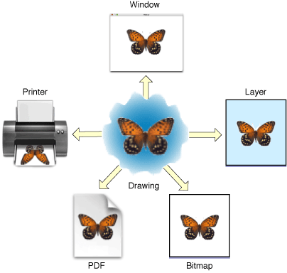
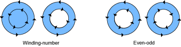
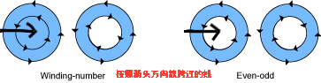

## AppKit

MacOS 相关

## Foundation

- NSDecimal & NSDecimalNumber

  用于精确计算，多用来计算货币相关

  ```c++
  int a = 99999999;
  float b = 0.01;
  double c = a*b;
  //这个计算的结果精度是会出问题的
  //NSDecimalNumber的计算是通过字符串转数字，对于a，b的类型自动处理
  ```

- NSNumberFormatter 设置数字按照一定的格式输出

  ```objective-c
  NSNumberFormatter *format = [NSNumberFormatter new];
  format.numberStyle = NSNumberFormatterPercentStyle;
  format.percentSymbol = @"百分";
  format.minusSign = @"负";
  
  NSLog(@"%@",[format stringFromNumber:[NSNumber numberWithFloat:-0.12]]);
  //负12百分
  ```

- NSData 避免在公共目录使用Data 的写入方法，它是不够安全的。 例如：writeToURL:atomically:写入文件，其他人可能对该文件进行破坏，或者将其伪装成硬、软连接导致你破坏其他系统资源。所以，在公共目录推荐使用包含了特定文件描述（file descriptor）的NSFileHandle;

  ```objective-c
  fd = mkstemp(tmpfile); // check return for -1, which indicates an error
  NSFileHandle *myhandle = [[NSFileHandle alloc] initWithFileDescriptor:fd];
  //mkstemp()函数在系统中以唯一的文件名创建一个文件并打开，而且只有当前用户才能访问这个临时文件，并进行读、写操作。
  //writeToURL:atomically: 的atomically 实现原理是先产生一个临时文件传输完毕了再拷贝到指定路径
  ```


## Core Graphics

- Graphics Contexts

  > You can think of a graphics context as a drawing destination, as shown in Figure 1-2. When you draw with Quartz, all device-specific characteristics are contained within the specific type of graphics context you use. In other words, you can draw the same image to a different device simply by providing a different graphics context to the same sequence of Quartz drawing routines. You do not need to perform any device-specific calculations; Quartz does it for you.

  

  对比：

  1. 相对于Bitmap PDF 存储的时命令序列
  2. 相对于Bitmap PDF 里的图片会根据设备显示特点优化
  3. 相对于Bitmap PDF 不会因为分辨率而不清晰 类似矢量图 其实对应了 1。
  4. 离屏绘制的时候使用layer要好于bitmap

- Graphics States

  Quartz 根据 当前状态（current graphics state） 来修改绘制的结果。

  每一个Graphics Context 都有一个Graphics State 栈。创建一个Graphics Context 后 就有了一个空的栈。

  CGContextSaveGState 会将当前的状态copy 到这个栈，也就是push进去。

  CGConextRestoreGState 则会pop这个栈。

  *ps： save和restore应是成对出现 保存一个当前使用的状态，当前使用完就pop*

- 坐标系

  CTM Current Transformation Matrix  

  Affine Transform 是CTM的一种

  相对于Default Coordinate  UIKit 的坐标系是 Modified Coordinate

- 内存管理

  >If you create or copy an object, you own it, and therefore you must release it. That is, in general, if you obtain an object from a function with the words “Create” or “Copy” in its name, you must release the object when you’re done with it. Otherwise, a memory leak results.
  >
  >If you obtain an object from a function that does not contain the words “Create” or “Copy” in its name, you do not own a reference to the object, and you must not release it. The object will be released by its owner at some point in the future.
  >
  >If you do not own an object and you need to keep it around, you must retain it and release it when you’re done with it. You use the Quartz 2D functions specific to an object to retain and release that object. For example, if you receive a reference to a CGColorspace object, you use the functions `CGColorSpaceRetain` and`CGColorSpaceRelease` to retain and release the object as needed. You can also use the Core Foundation functions `CFRetain` and `CFRelease`, but you must be careful not to pass `NULL` to these functions.

- Paths

  1. > Quartz routines that add ellipses and rectangles add a new closed subpath to the path.

  2. 三种 join 两条线段结合的部分：miter 尖尖的，round 圆圆的, revel 平平的

  3. 三种 cap 一个线段的两端：butt 直接在端点停下来，平的；round 在端点 画圆半径是线宽一半；projecting square 在端点画方 延长线宽一半（和round长度一样）

  4. 两种填充策略

     

     nonzero winding-number ：

     >To determine whether a specific point should be painted, start at the point and draw a line beyond the bounds of the drawing. Starting with a count of 0, add 1 to the count every time a path segment crosses the line from left to right, and subtract 1 every time a path segment crosses the line from right to left. If the result is 0, the point is not painted. 

     Even-odd:

     > To determine whether a specific point should be painted, start at the point and draw a line beyond the bounds of the drawing. Count the number of path segments that the line crosses. If the result is odd, the point is painted. If the result is even, the point is not painted. The direction that the path segments are drawn doesn’t affect the outcome. 

     

  5. Blend Modes 混合模式

     透明度的默认混合公式：

     ​	Result = alpha * foregroudColor +  (1 - alpha) * backgroundColor

     详细Blend Mode 对比 [举例参考](https://developer.apple.com/library/archive/documentation/GraphicsImaging/Conceptual/drawingwithquartz2d/dq_paths/dq_paths.html)

- Color And ColorSpaces

  1. 四种 Color Spaces ： Device-independent, Generic, Device-dependent, Indexed and Pattern

     其中前两个iOS不能使用，iOS一般使用Device-dependent

     对于 macOS  一般使用Generic

     对于 image 场景一般使用Device-dependent color space 的 CGColorSpaceCreateDeviceGray 

  2. 设置颜色 指明color space  或者使用 CGColor （构造时候会说明color space）

- Transforms

  变化是一种Graphics State 可以通过save 和 restore state 来记录和恢复

  3x3 变幻矩阵：

  1. 主要是前面两个column起作用，第三个column是为了能实现矩阵乘法（变化矩阵拼接）
  2. 前两个column 的最后一行是加法因子 tx ty 分别控制着代表了x、y的偏移量
  3. 前两个column 的上面两行 是乘法因子 决定了放大缩小以及角度旋转（旋转变化考虑利用的向量夹角相关知识）

- Pattern

  Pattern 是一种图案用起来像颜色一样

- Shadows

  1. CGShading & CGGradient Object : CGGradient 继承 CGShading 封装了绘制方法（CGFunction），你只需要传入颜色 位置对应关系即可，而CGShading需要自己写颜色怎样过渡变化。简单效果CGGradient实现比较方便，复杂效果CGShading可能更方便。
  2. CGGradient可以同时绘制轴向效果和径向效果，而CGShading需要分开创建对象绘制。
  3. CGGradient 坐标是在绘制时候设置，而CGShading是在创建时候

- Transparency Layers

  在透明图层上绘制的多个组合图形会被当做一个整体对待


## Color Management

- RGB & CMYK 

  它们都是三原色，一个用于会发光的场景，例如显示器，又叫叠加色，因为它是通过三种颜色的叠加产生颜色。一个用于反光的场景，例如报纸，又叫削减色，因为它是通过吸收白光的其他成分显出颜色。

  CMYK： Cyan 青色-天蓝色 Magenta 品红色-洋红色 Yellow 黄色 Key Plate 黑色，三原色是CMY 黑色用来增加饱和度，CMY调出的黑色不够浓郁


## iOS Data Storage Guidelines

- 只有用户创建的文件 或者 应用不能再创建的文档存储在Documents, 该目录会被iCloud同步（需要长期保存，不可以重新生成）
- 可以重新下载或者重新创建的文件放在Library/Cache， 例如下载的离线地图 或者 离线文章（需要较长期保存，但又可重新生成）。处理Cache，Library里的文件也会被备份到iCloud
- 临时文件放在 tmp （不需要长期保存，可以重新生成），用完后主动删除
- 可以给文件 “do not back up”属性，从而保证文件永远在本地，即使低内存的时候也不会删除，该属性不管在哪个目录都生效。这样的文件不会被清除，也不会被备份到iCloud。

## [Text Hanling in iOS](<https://developer.apple.com/library/archive/documentation/StringsTextFonts/Conceptual/TextAndWebiPhoneOS/Introduction/Introduction.html>)


- 整体字体高度为 Line Height = Ascent + Descent + Line gap（leading）
- Ascent = Cap height + xxx（没有名称，字母出头部分）
- BaseLine 以上为 Ascent
- BaseLine 以下为 Descent
- Line Gap 为两行字的间距


