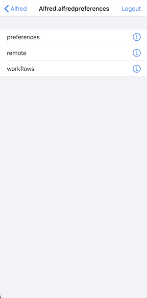
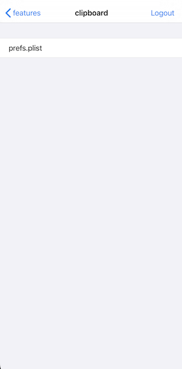
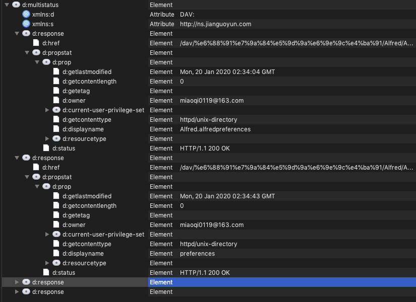
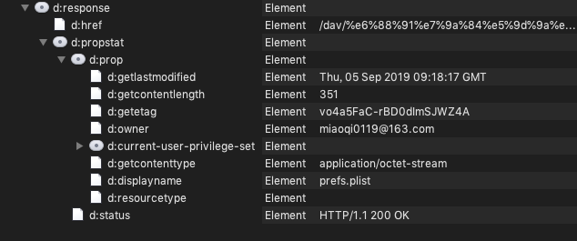

# WebDAV 协议简介

Web-based Distributed Authoring and Versioning 一种基于 HTTP 1.1协议的通信协议。它扩展了HTTP 1.1，在GET、POST、HEAD等几个HTTP标准方法以外添加了一些新的方法，使应用程序可对Web Server直接读写，并支持写文件锁定(Locking)及解锁(Unlock)，还可以支持文件的版本控制。

坚果云，Dropbox 都支持这个协议

## 协议方法

### HTTP

- GET

- POST

- PUT：类似POST 只是使用PUT 是 idempotent 的，使用的地方需要保证每次发出产生的效果一样

> - “Methods can also have the property of "idempotence" in that (aside from error or expiration issues) the side-effects of N > 0 identical requests is the same as for a single request.”

> - 

> - 上面的话就是说，如果一个方法重复执行多次，产生的效果是一样的，那就是idempotent的

### 扩展

- PROPFIND：从Web资源中检索以XML格式存储的属性，检索远程系统的集合结构（也叫目录层次结构）。

- COPY：将资源从一个URI（Uniform Resource Identifier）复制到另一个URI

- MOVE：将资源从一个URI移动到另一个URI

- MKCOL：创建集合（即目录）

- DELETE：删除一个资源

- LOCK：锁定一个资源。WebDAV支持共享锁和互斥锁。

- UNLOCK：解除资源的锁定

- PROPPATCH：在单个原子性动作中更改和删除资源的多个属性

## Demo

以坚果云为例， `Swift` 语言

### 生成应用授权

- 获得服务器地址

- 用户名

- 密码

### 获取资源列表举例

```swift
var request = URLRequest(url: url)
request.httpMethod = "PROPFIND"
self.session?.dataTask(with: request) { (data, response, error) **in**
   print(response ?? "No response")
}.resume()
```

#### 结果列表

**列表**



**单个文件**



#### 抓包数据

P1 对应 列表视图



P2 对应单个文件页



**属性**

- `href`  URI 路径

- `getlastmodified`  修改时间 

- `getcontentlength` 文件大小

- `getetag` GET Entity Tag （ETag） 用来标识文件缓存

- `owner`  所有者

- `current-user-privilege-set` 用户有哪些权限（读写等）

- `getcontenttype` 文件类型  对应 HTTP Header 的 content-type 

- `displayname` 显示名称

- `resourcetype` 资源类型 如果是文件夹（P1）就是 collection 文件（P2）没有值

###上传文件举例

```swift
 var request = URLRequest(url: url)
      request.httpMethod = "PUT"
self.session?.uploadTask(with: request, fromFile: URL(fileURLWithPath: filePath), completionHandler: { (data, response, error) in
        print(response ?? "No response")
 }).resume()
```

###删除文件举例

```swift
var request = URLRequest(url: url)
      request.httpMethod = "DELETE"
self.session?.dataTask(with: request, completionHandler: { (data, response, error) in
  print(response ?? "No response")
}).resume()
```

### 怎么读 RFC 文档

[How to Read an RFC](https://www.mnot.net/blog/2018/07/31/read_rfc)

## 参考

[WebDAV 维基百科](https://zh.wikipedia.org/wiki/基于Web的分布式编写和版本控制)

[WebDAV 百度百科](https://baike.baidu.com/item/WebDAV/4610909?fr=aladdin)

[PUT 与 POST 的区别](https://blog.csdn.net/mad1989/article/details/7918267)

[WebDAV RTF4918](https://tools.ietf.org/html/rfc4918)

[关于 ETag](https://whatis.techtarget.com/definition/entity-tag-Etag)